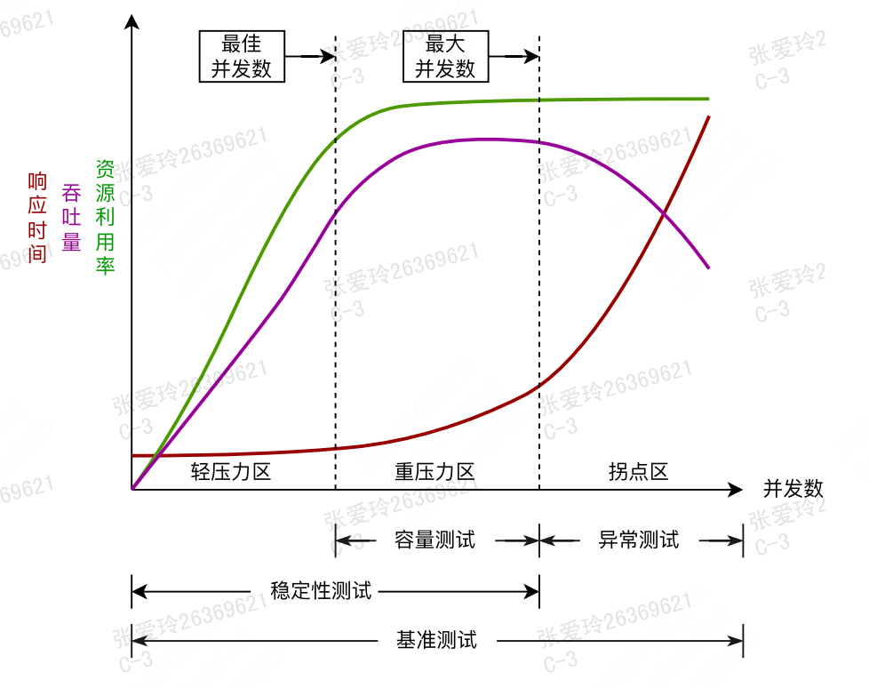

# 性能测试
## 压测脚本
1. 准备jmeter压测脚本，提前线上小流量调试通过
   1. 如果同一个场景下包含多个接口，预期qps不同，可以分别设置吞吐量控制器（throughout controller），例如接口1需要100个线程，接口2只需要50个线程发压，那么设置吞吐量为50
   
   

## 资源预估
1. 业务预估使用人数及预期响应时间
2. 计算目标QPS：

## 发压策略
使用阶梯式发压，分别使用50、100、150、200的并发去执行

## 停止策略
1. 发压机cpu占用超过80% [负载定义](新人培训.md)
2. 发压机的load1超过10（cpu核数的2.5倍），良好情况：load1<=4(发压机cpu数)
    - load情况分为load1、load5、load15三种情况，分别代表最近1分钟、5分钟、15分钟的cpu负载情况，一般只是load1临时高，代表临时波动，如果load5和load15都高，说明主机在一段时间内都处于高负载情况
3. 服务批量报错
4. 出现高优预警
5. 服务P99响应时间超出预期
6. 出现性能拐点